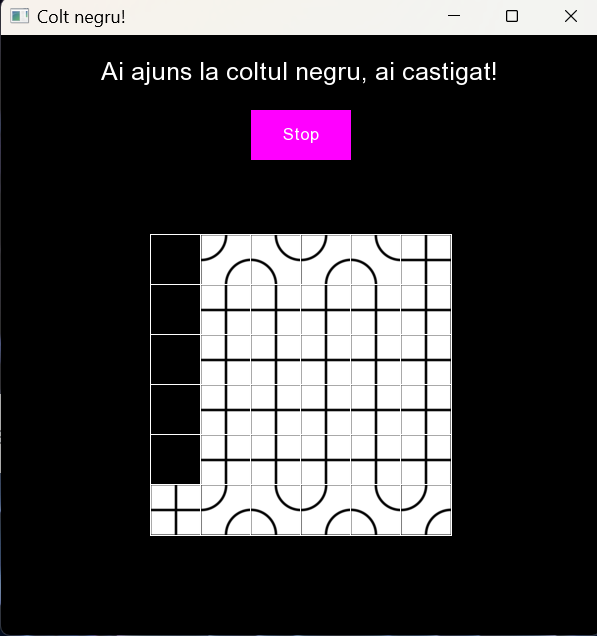
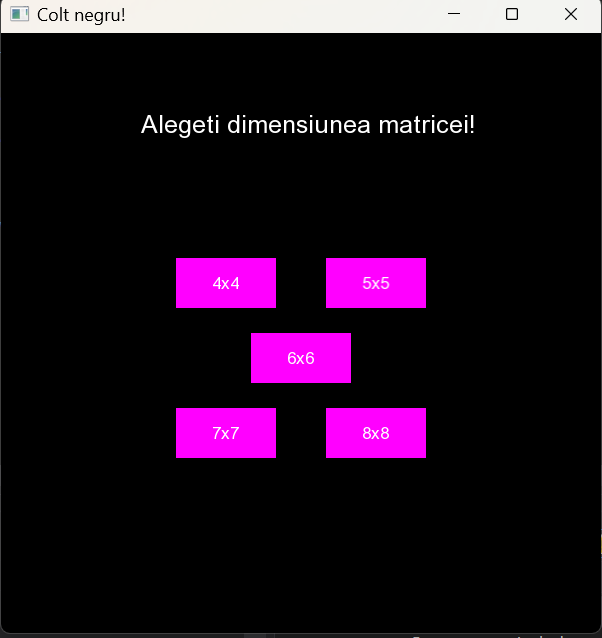

# Black Corner Game

A **2-player puzzle game** played on an **N×N grid**.  
Players take turns extending a path with tiles (3 types available).  
The goal is simple: **reach the black corner** to win.

## Screenshots

## How to Play
- Choose the board size: **4×4 up to 8×8**.
- Players take turns clicking on a **valid cell** to continue the path.
- Clicking the same cell again cycles its tile type (**1 → 2 → 3**), changing how the path continues.
- Press **Stop** to confirm your move.
- **Win:** reach the black corner.  
- **Lose:** if after your move there are no valid moves left.
